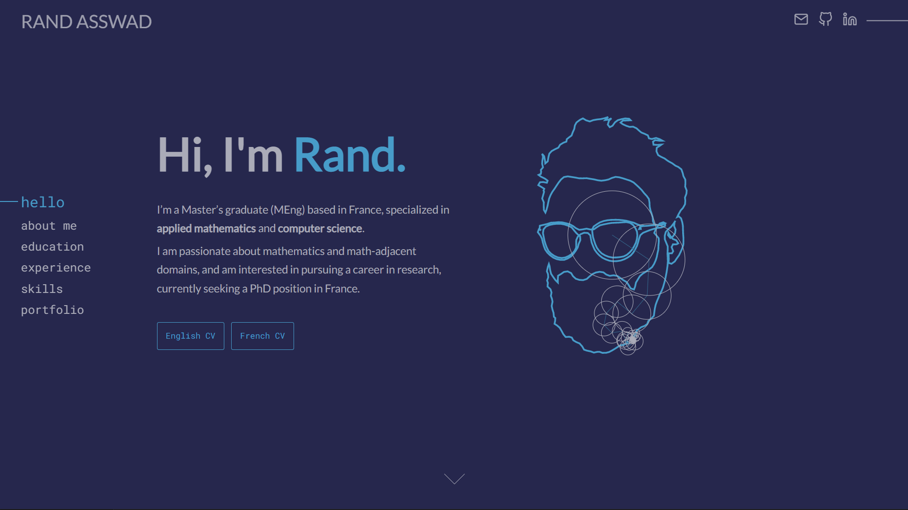

# About

My personal website built with [jekyll](https://jekyllrb.com)
hosted by [GitHub Pages](https://pages.github.com/).

# Features

- A desktop-first responsive design
- Rich components:
  - SVG epicycles sketching a path (coordinates list)
  - Responsive tabs for small content (experience, projects)
  - Accordeon-styled section
  - Responsive nav menu
  - A simple loader
- SEO and [Open Graph](https://ogp.me/)
- GitHub's [Feather SVG Icons](https://feathericons.com/)
- No more bloated CSS/JS libraries! *I am big boy now.*

# Theme

## Color Scheme

## Fonts

Using [Google Fonts](https://fonts.google.com/),
with [best practices for fonts](https://web.dev/font-best-practices/)
in mind to optimize performance.

- **Sans serif:** [Lato](https://fonts.google.com/specimen/Lato) by Łukasz Dziedzic
- ~~**Serif:** [Roboto Slab](https://fonts.google.com/specimen/Roboto+Slab) by Christian Robertson~~
- **Monospace:** [Roboto Mono](https://fonts.google.com/specimen/Roboto+Mono) by Christian Robertson

# Lighthouse report

A near perfect score on the [Lighthouse](https://github.com/GoogleChrome/lighthouse)
performance test!

Full JSON report
[here](https://gist.githubusercontent.com/rand-asswad/37c5f8595a8e3e0000b5b73126198b2e/raw/cb47c8ee752a237a6f4f9641d86556ef9060d4f5/rand-asswad.xyz_2022-03-29_24-55-37.lighthouse.report.json)

I optimized performance as much as possible, ditched bloated libraries
I was using (Bootstrap, jQuery, FontAwesome, etc),
and tried my best to follow best practices.
I recommend reading guides from [web.dev](https://web.dev/).

This website has a desktop-first responsive design,
the Lighthouse performance test for the mobile version is in the 60s.

# Jekyll Plugins

This website does not *depend* on any plugins to work.

Nevertheless, I have configured and tested
[jekyll-minifier](https://github.com/digitalsparky/jekyll-minifier) locally
for minifying JS and HTML, I think it's excellent.
Unfortunally, GitHub Pages does not build sites using
"[unsupported plugins](https://docs.github.com/en/pages/setting-up-a-github-pages-site-with-jekyll/about-github-pages-and-jekyll#plugins)"
so in order to use third-party plugins, one must build the site locally
then deploy the static files to GitHub (the process can be automated).

That being said, I will probably end up doing so, but I can do without it for now.

# Forking

This repo is under the MIT License, you can use any of its components
as long as you acknowledge its authors.

I was inspired by many designs and elements on [CodePen](https://codepen.io/).
While I haven't forked/copied code, I have used designs from others,
notabely [Brittany Chiang](https://brittanychiang.com/)'s website.

Also, I'm pretty proud of my SVG Fourier epicycles animation,
I did it from scratch in [Vanilla JS](http://vanilla-js.com/) to optimize its speed,
so please give me credit if you use it in your work.
I'm probably going to open up a repo for it.